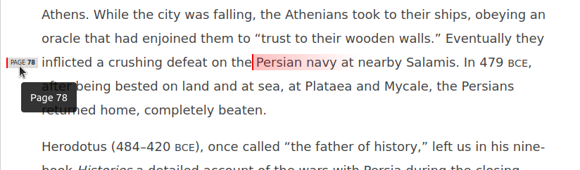

# webreader.io page number marker
I need to reference page numbers for ebooks on webreader.io/cengage.
Irritatingly, even though there _are_ page number markers, the UI itself doesn't
render them. There's even a "go to page" feature, yet there's **no indication**
where a page starts or ends as multiple pages are usually collected on one page.

This userscript (find a build at [built script](dist/webreader.js)) add page
markers to the page to indicate where page breaks are located as seen in the
screenshot. The gradient effect shows when you hover the pagenumber.

## Screenshot

## License
MIT

