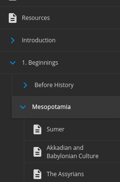

# webreader.io enhancer
I need to reference page numbers for ebooks on webreader.io/cengage.
Irritatingly, even though there _are_ page number markers, the UI itself doesn't
render them. There's even a "go to page" feature, yet there's **no indication**
where a page starts or ends as multiple pages are usually collected on one page.

This userscript (find a build [here](dist/webreader.js)) add page
markers to the page to indicate where page breaks are located as seen in the
screenshot. The gradient effect shows when you hover the pagenumber.

It also adds visual nesting to the table of contents, that before despite having
hierarchy, confusingly lacked any indicate of how the hierarchy was structured.

## How to use
 1. Install [Tampermonkey](https://www.tampermonkey.net/)

 2. Install this userscript by going [here](https://raw.githubusercontent.com/b-fuze/webreader-pagemarker/master/dist/webreader.user.js)

 3. Profit :')

## Screenshot
Page numbers

Nesting

## License
MIT

